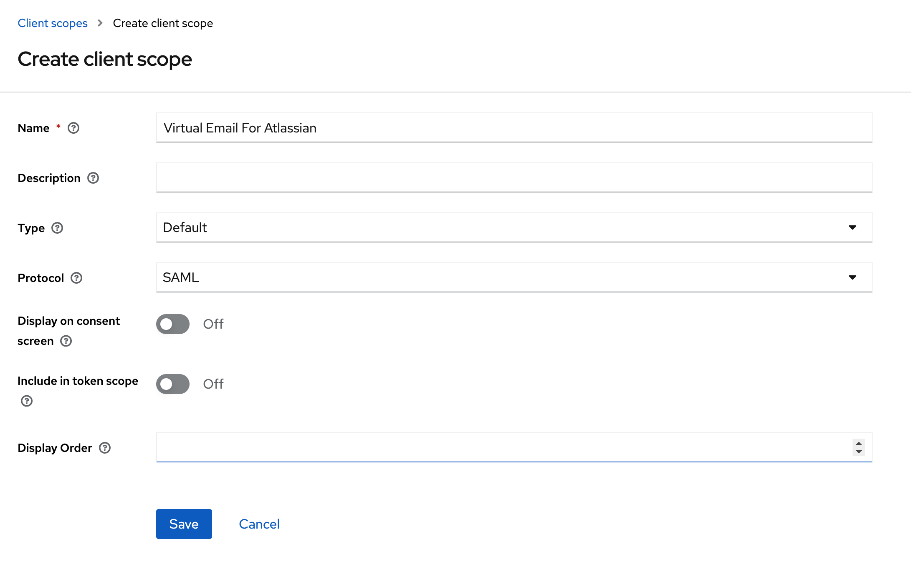
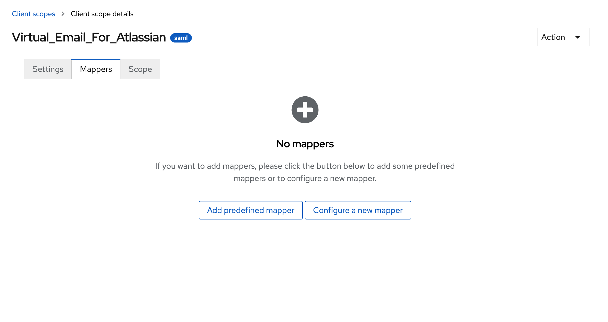
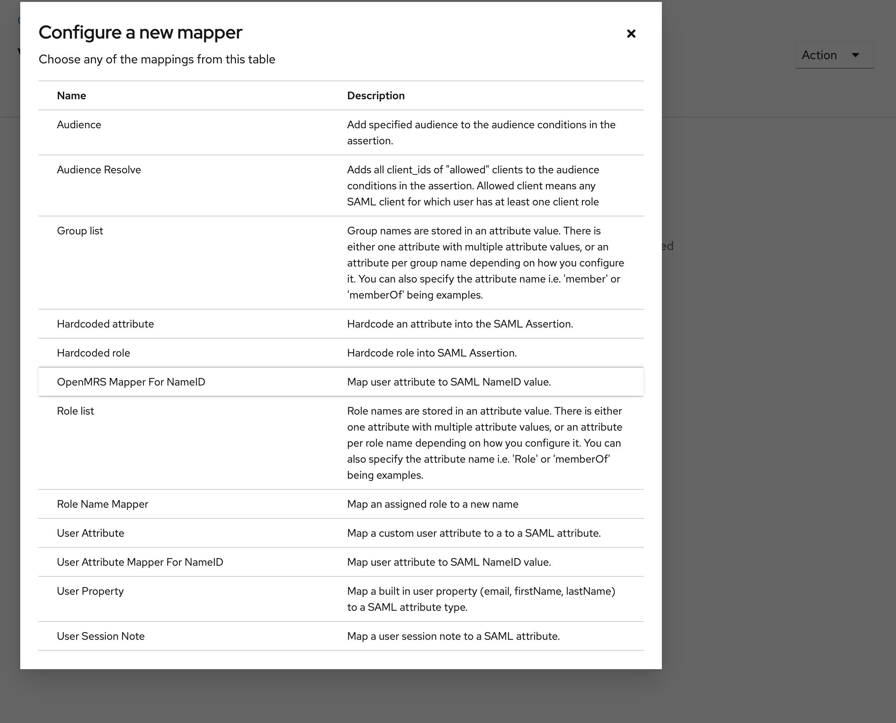
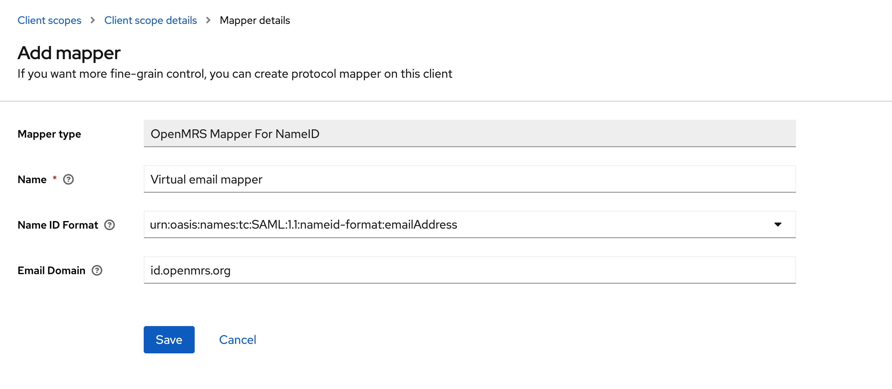
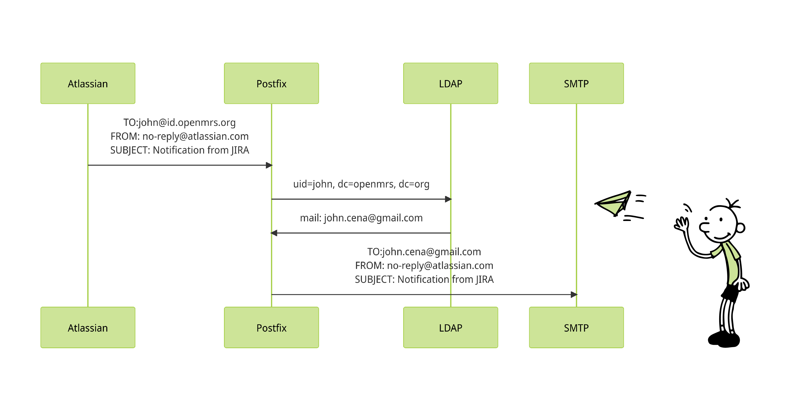

# OpenMRS ID

This repository contains the following

1. Keycloak extension
2. Postfix Docker configuration
3. Keycloak Theme

## Keycloak Extension

OpenMRS needs users to be login to Atlassian cloud through OpenMRS ID to make it easier for people to be recognized across community services and to reduce the burden of supporting accounts across multiple services. 

However, Currently Atlassian cloud let use orgs their own SSOs if only the users have an account with a verified domain. But not every user has an openmrs email, and it’s expensive for OpenMRS to provide all users a mailbox, and it’s hard for users to use multiple mailboxes.

To facilitate the requirement, we had to introduce a virtual email address based on the username. However, Keycloak does not support to map such a dynamic field to the NameID of the SAML response. This Keycloak extension helps to add the said virtual email address to the NameID field.

In order to use the extension you have to follow this:
1. Navigate to Client Scopes > Create Client Scope 
   Give it a name, set type to default and set protocol to SAML

   

2. Go to the created Client Scope and Click on the Mappers tab. and then click on Configure a new mapper.
    
    
    
    pick “OpenMRS Mapper For NameID”
    
    
    
3. Pick NameID format and add the email domain.
    
    
    
4. Go to Clients > select your client > Client Scopes > Add Client Scope

pick the created client scope and add as a default. 

The extension is building as a jar and it will be copied to the keycloak image when building the keyclaok image. Learn more about keycloak extensions here: [Service Provider Interfaces (SPI)](https://www.keycloak.org/docs/latest/server_development/#_providers)

## Keycloak Extension

OpenMRS requires users to log in to Atlassian cloud through OpenMRS ID. This makes it easier for people to be recognized across community services and reduces the burden of supporting multiple accounts. However, currently Atlassian cloud only allows organizations to use their own SSOs if users have an account with a verified domain. Since not every user has an OpenMRS email, it is expensive for OpenMRS to provide all users with a mailbox, and it is difficult for users to manage multiple mailboxes.

To meet this requirement, a virtual email address was implemented based on the username format: <username>@id.openmrs.org. However, Keycloak does not support mapping this dynamic field to the NameID in the SAML response. This Keycloak extension solves this issue by adding the virtual email address to the NameID field.

To use the extension, follow these steps:

1. Navigate to Client Scopes and create a new Client Scope. Give it a name, set the type to default, and set the protocol to SAML.


1. Go to the created Client Scope and click on the Mappers tab. Then, click on "Configure a new mapper."


Choose "OpenMRS Mapper For NameID."


1. Select the NameID format and add the email domain.


1. Go to Clients, select your client, go to Client Scopes, and add the created client scope as a default.

The extension is built as a `jar` and will be copied to the Keycloak image during the Keycloak image build. Learn more about Keycloak extensions [here](a link).

## Postfix

The user's email is saved by Atlassian as the virtual email address mentioned above. As a result, all notifications and other emails are sent to the virtual email address. A mechanism was needed to forward these emails to the user's actual email address. Postfix was chosen to fulfill this requirement. Postfix is a free and open-source mail transfer agent (MTA) that routes and delivers email messages.

Whenever Atlassian receives an email, postfix queries for a user in the LDAP where the username is the username part of the received email address. Then, it retrieves the email address of the returned user and forwards the received email.



## Keycloak Theme

This theme is to enhace the look and feel of the login and registration process. 

This is a custom theme for OpenMRS ID based on the [Keywind](https://github.com/lukin/keywind) theme for Keycloak.

### **Add a custom announcement**

To add a custom announcement, you can edit the `template.ftl` file.

ex:

```
<@alert.kw color="warning">This is a custom message!</@alert.kw>
```

Learn more about Keycloak themes here: [Keycloak Themes](https://www.keycloak.org/docs/latest/server_development/#_themes). 
